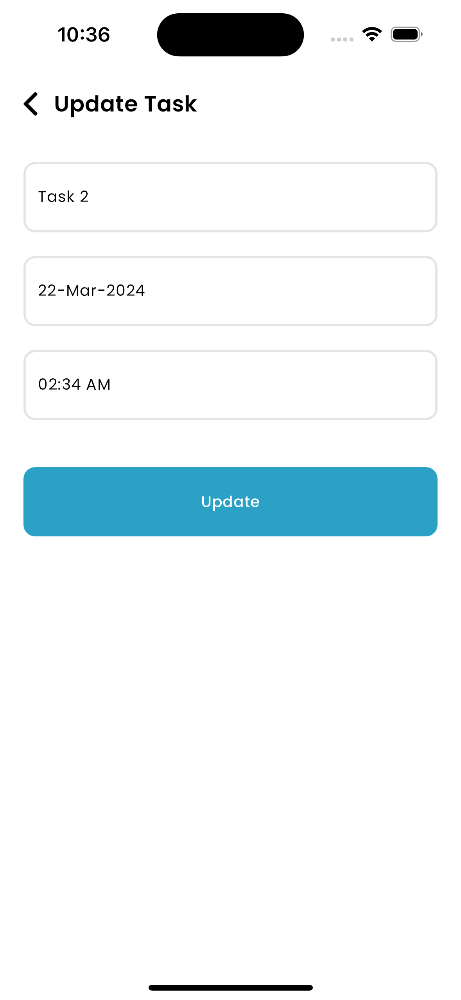

# Task Manager App

This is a Task Manager app built using Flutter, BLoC (Business Logic Component), and Hive database. It allows users to manage their tasks by adding, updating, viewing, and removing them.

## Features

- **Add New Task**: Users can add a new task with a title, date, and time.
- **Update Task**: Users can update the details of an existing task.
- **View Tasks**: Users can view the list of tasks they've added.
- **Remove Tasks**: Users can remove tasks from the list.

## Architecture

The app follows the Clean Architecture principles, separating concerns into layers:

- **Presentation Layer**: Includes UI components, built with Flutter widgets.
- **Domain Layer**: Contains business logic and use cases.
- **Data Layer**: Manages data operations using Hive database.

## Technology Stack

- **Flutter**: Framework for building cross-platform mobile applications.
- **BLoC Library**: Provides tools for implementing Business Logic Components in Flutter.
- **Hive**: Lightweight and fast NoSQL database for local storage in Flutter.

## Usage

1. Launch the app.
2. Add a new task by providing the title, date, and time.
3. View the list of tasks added. 
4. Update the details of a task if needed. 
5. Remove tasks from the list as necessary.

## Acknowledgments

1. **Flutter**: [Flutter](https://flutter.dev/).
2. **Bloc Pattern**: [Bloc Pattern](https://bloclibrary.dev/).
2. **Hive**: [Hive](https://pub.dev/packages/hive).

You can download the apk from the [link](https://drive.google.com/file/d/1zRbJz9VcpoUtqquS8GTcu89Z4L8hY52C/view?usp=sharing)

## Screen shots
 
 

